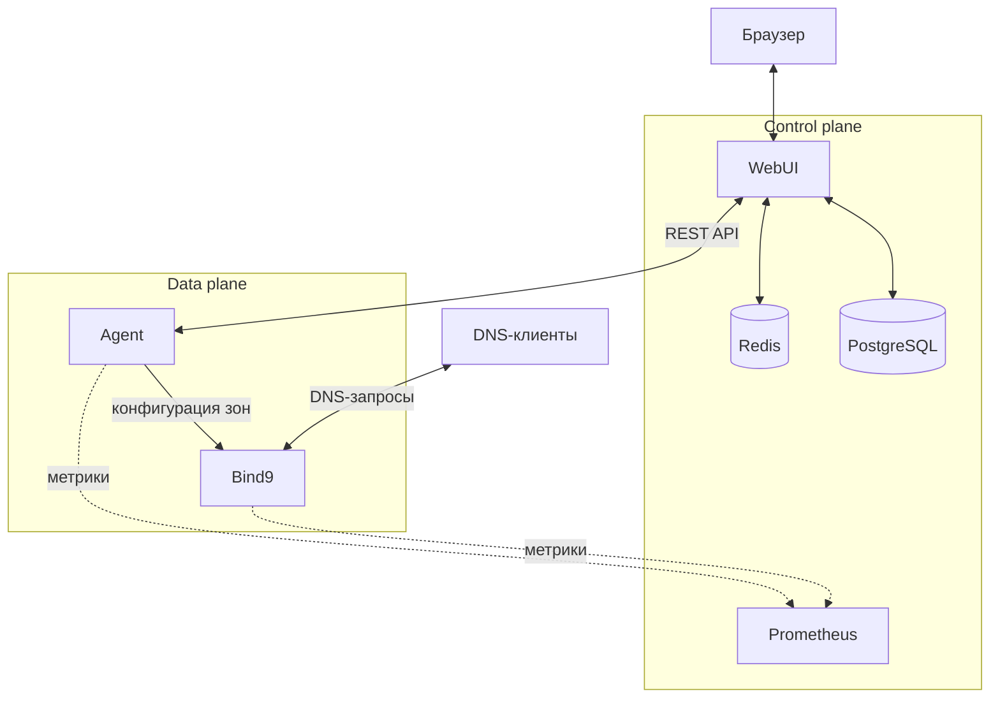

## Блок-схема

```mermaid
flowchart TD
    subgraph Control [Control plane]
        WebUI[WebUI]
        DB[(PostgreSQL)]
        Cache[(Redis)]
        Prometheus[(Prometheus)]
    end
    subgraph Data [Data plane]
        Agent[Agent]
        Bind9[Bind9]
    end
    Browser[Браузер]
    Clients[DNS-клиенты]
    Prometheus[Prometheus]
    Browser <--> WebUI
    WebUI <--> DB
    WebUI <--> Cache
    WebUI <-->|REST API| Agent
    Agent -->|конфигурация зон| Bind9
    Bind9 -.->|метрики| Prometheus
    Agent -.->|метрики| Prometheus
    Clients <-->|DNS-запросы| Bind9
```

## Компоненты

- WebUI
- PostgreSQL
- Redis
- Agent
- Bind9
- Prometheus
